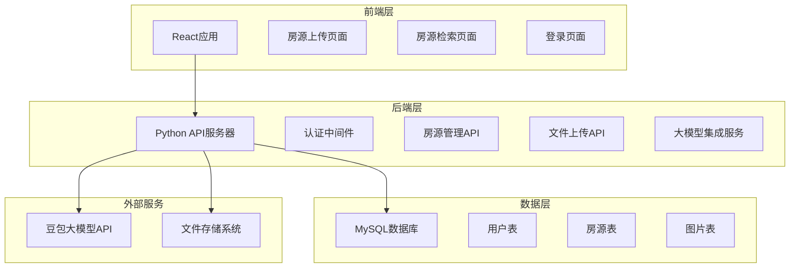
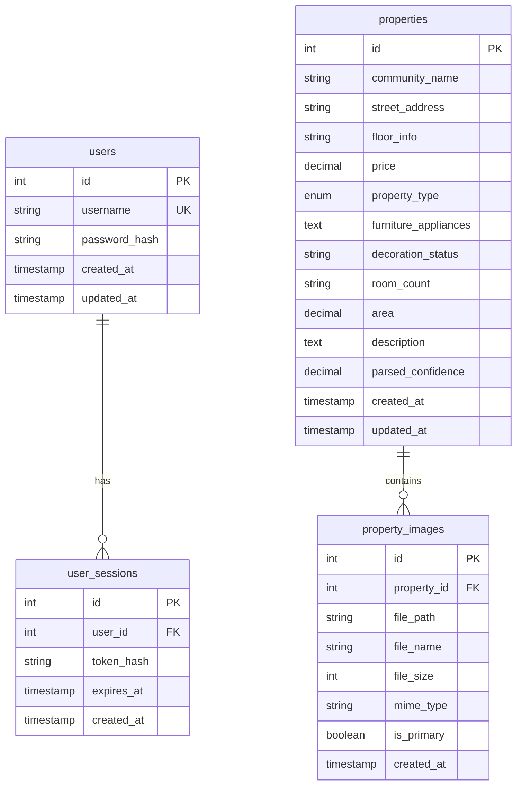

# 设计文档

## 概述

房屋中介管理系统是一个全栈Web应用，采用前后端分离架构。前端使用React构建用户界面，后端使用Python Flask/FastAPI提供RESTful API服务，MySQL作为数据存储，集成豆包大模型进行房源文本智能解析。

系统核心功能包括：
- 智能房源文本解析和结构化存储
- 房源信息管理和图片上传
- 房源搜索和筛选
- 用户身份验证和会话管理

## 架构

### 系统架构图



### 技术栈

**前端：**
- React 18+ (用户界面框架)
- React Router (路由管理)
- Axios (HTTP客户端)
- Ant Design 或 Material-UI (UI组件库)
- React Hook Form (表单管理)

**后端：**
- Python 3.9+
- FastAPI (Web框架，提供自动API文档)
- SQLAlchemy (ORM)
- Alembic (数据库迁移)
- Pydantic (数据验证)
- python-multipart (文件上传支持)
- python-jose (JWT令牌处理)
- passlib (密码哈希)

**数据库：**
- MySQL 8.0+

**外部服务：**
- 豆包大模型API (文本解析，特别注重租房/售房类型识别)

## 组件和接口

### 前端组件架构

```
src/
├── components/
│   ├── common/
│   │   ├── Header.jsx          # 导航头部
│   │   ├── Loading.jsx         # 加载组件
│   │   ├── ProtectedRoute.jsx  # 路由保护
│   │   └── PropertyTypeToggle.jsx # 租房/售房切换组件
│   ├── upload/
│   │   ├── TextInput.jsx       # 文本输入组件
│   │   ├── PropertyForm.jsx    # 房源表单组件 (包含类型选择)
│   │   └── ImageUpload.jsx     # 图片上传组件
│   └── search/
│       ├── PropertyList.jsx    # 房源列表组件
│       ├── SearchFilters.jsx   # 搜索筛选组件 (包含类型筛选)
│       ├── PropertyDetail.jsx  # 房源详情组件
│       ├── RentPropertyList.jsx # 租房专用列表组件
│       └── SalePropertyList.jsx # 售房专用列表组件
├── pages/
│   ├── Login.jsx              # 登录页面
│   ├── Upload.jsx             # 房源上传页面
│   └── Search.jsx             # 房源检索页面
├── services/
│   ├── api.js                 # API服务封装
│   ├── auth.js                # 认证服务
│   └── upload.js              # 上传服务
└── utils/
    ├── constants.js           # 常量定义
    └── helpers.js             # 工具函数
```

### 后端API接口设计

#### 认证相关API
```python
POST /api/auth/login
# 请求体: {"username": "string", "password": "string"}
# 响应: {"access_token": "string", "token_type": "bearer", "expires_in": 604800}

POST /api/auth/refresh
# 请求头: Authorization: Bearer <token>
# 响应: {"access_token": "string", "expires_in": 604800}

POST /api/auth/logout
# 请求头: Authorization: Bearer <token>
# 响应: {"message": "Successfully logged out"}
```

#### 房源管理API
```python
POST /api/properties/parse
# 请求体: {"text": "房源描述文本"}
# 响应: {"parsed_data": {"property_type": "rent|sale", "price": 3000, ...}, "confidence": 0.95}

POST /api/properties
# 请求体: 房源信息 + 图片文件 (必须包含property_type字段)
# 响应: {"id": 1, "message": "Property created successfully"}

GET /api/properties
# 查询参数: ?page=1&size=20&community=小区名&street=街道&type=rent|sale&min_price=1000&max_price=5000
# 响应: {"items": [...], "total": 100, "page": 1, "size": 20}

GET /api/properties/rent
# 专门获取租房信息
# 查询参数: ?page=1&size=20&community=小区名&min_rent=1000&max_rent=5000
# 响应: {"items": [...], "total": 50, "page": 1, "size": 20}

GET /api/properties/sale
# 专门获取售房信息  
# 查询参数: ?page=1&size=20&community=小区名&min_price=500000&max_price=2000000
# 响应: {"items": [...], "total": 50, "page": 1, "size": 20}

GET /api/properties/{id}
# 响应: 完整房源信息包括图片列表

PUT /api/properties/{id}
# 请求体: 更新的房源信息
# 响应: {"message": "Property updated successfully"}

DELETE /api/properties/{id}
# 响应: {"message": "Property deleted successfully"}
```

#### 文件上传API
```python
POST /api/upload/images
# 请求: multipart/form-data with files
# 响应: {"uploaded_files": ["path1", "path2"]}

DELETE /api/upload/images/{filename}
# 响应: {"message": "Image deleted successfully"}
```

### 后端服务架构

```
app/
├── main.py                    # FastAPI应用入口
├── config.py                  # 配置管理
├── database.py                # 数据库连接
├── models/
│   ├── __init__.py
│   ├── user.py               # 用户模型
│   ├── property.py           # 房源模型
│   └── image.py              # 图片模型
├── schemas/
│   ├── __init__.py
│   ├── user.py               # 用户数据模式
│   ├── property.py           # 房源数据模式
│   └── image.py              # 图片数据模式
├── services/
│   ├── __init__.py
│   ├── auth_service.py       # 认证服务
│   ├── property_service.py   # 房源业务逻辑
│   ├── llm_service.py        # 大模型集成服务
│   └── file_service.py       # 文件处理服务
├── routers/
│   ├── __init__.py
│   ├── auth.py               # 认证路由
│   ├── properties.py         # 房源路由
│   └── upload.py             # 上传路由
└── utils/
    ├── __init__.py
    ├── security.py           # 安全工具
    ├── dependencies.py       # 依赖注入
    ├── exceptions.py         # 异常处理
    └── property_parser.py    # 房源文本解析工具(租房/售房识别)
```

## 数据模型

### 数据库表结构

#### 用户表 (users)
```sql
CREATE TABLE users (
    id INT PRIMARY KEY AUTO_INCREMENT,
    username VARCHAR(50) UNIQUE NOT NULL,
    password_hash VARCHAR(255) NOT NULL,
    created_at TIMESTAMP DEFAULT CURRENT_TIMESTAMP,
    updated_at TIMESTAMP DEFAULT CURRENT_TIMESTAMP ON UPDATE CURRENT_TIMESTAMP
);
```

#### 房源表 (properties)
```sql
CREATE TABLE properties (
    id INT PRIMARY KEY AUTO_INCREMENT,
    community_name VARCHAR(100) NOT NULL,           -- 小区名称
    street_address VARCHAR(200) NOT NULL,           -- 街道地址
    floor_info VARCHAR(50),                         -- 楼层信息
    price DECIMAL(12,2) NOT NULL,                   -- 价格 (租房为月租金，售房为总价)
    property_type ENUM('sale', 'rent') NOT NULL,    -- 房屋类型 (sale=售房, rent=租房)
    furniture_appliances TEXT,                      -- 家具家电配置
    decoration_status VARCHAR(100),                 -- 装修情况
    room_count VARCHAR(20),                         -- 房间数量 (如: 2室1厅)
    area DECIMAL(8,2),                             -- 面积
    description TEXT,                               -- 原始描述文本
    parsed_confidence DECIMAL(3,2),                 -- 解析置信度
    created_at TIMESTAMP DEFAULT CURRENT_TIMESTAMP,
    updated_at TIMESTAMP DEFAULT CURRENT_TIMESTAMP ON UPDATE CURRENT_TIMESTAMP,
    
    INDEX idx_community (community_name),
    INDEX idx_street (street_address),
    INDEX idx_type_price (property_type, price),    -- 复合索引，支持按类型和价格范围查询
    INDEX idx_type (property_type),
    INDEX idx_price (price)
);
```

#### 图片表 (property_images)
```sql
CREATE TABLE property_images (
    id INT PRIMARY KEY AUTO_INCREMENT,
    property_id INT NOT NULL,
    file_path VARCHAR(500) NOT NULL,                -- 图片文件路径
    file_name VARCHAR(255) NOT NULL,                -- 原始文件名
    file_size INT NOT NULL,                         -- 文件大小(字节)
    mime_type VARCHAR(50) NOT NULL,                 -- MIME类型
    is_primary BOOLEAN DEFAULT FALSE,               -- 是否为主图
    created_at TIMESTAMP DEFAULT CURRENT_TIMESTAMP,
    
    FOREIGN KEY (property_id) REFERENCES properties(id) ON DELETE CASCADE,
    INDEX idx_property (property_id)
);
```

#### 会话表 (user_sessions)
```sql
CREATE TABLE user_sessions (
    id INT PRIMARY KEY AUTO_INCREMENT,
    user_id INT NOT NULL,
    token_hash VARCHAR(255) NOT NULL,               -- JWT令牌哈希
    expires_at TIMESTAMP NOT NULL,                  -- 过期时间
    created_at TIMESTAMP DEFAULT CURRENT_TIMESTAMP,
    
    FOREIGN KEY (user_id) REFERENCES users(id) ON DELETE CASCADE,
    INDEX idx_user (user_id),
    INDEX idx_token (token_hash),
    INDEX idx_expires (expires_at)
);
```

### 数据模型关系



## 错误处理

### 错误响应格式
```json
{
    "error": {
        "code": "VALIDATION_ERROR",
        "message": "输入数据验证失败",
        "details": {
            "field": "price",
            "reason": "价格必须为正数"
        }
    }
}
```

### 错误类型定义
- `AUTHENTICATION_ERROR`: 认证失败
- `AUTHORIZATION_ERROR`: 权限不足
- `VALIDATION_ERROR`: 数据验证错误
- `NOT_FOUND_ERROR`: 资源不存在
- `DUPLICATE_ERROR`: 数据重复
- `FILE_UPLOAD_ERROR`: 文件上传错误
- `LLM_SERVICE_ERROR`: 大模型服务错误
- `DATABASE_ERROR`: 数据库操作错误
- `INTERNAL_SERVER_ERROR`: 服务器内部错误

### 错误处理策略
1. **前端错误处理**: 使用统一的错误拦截器处理API响应错误
2. **后端错误处理**: 使用FastAPI的异常处理机制统一处理和记录错误
3. **大模型服务错误**: 实现重试机制和降级策略
4. **文件上传错误**: 提供详细的文件验证错误信息
5. **数据库错误**: 记录详细日志并返回用户友好的错误信息

## 测试策略

### 单元测试
- **后端**: 使用pytest测试所有服务层和API端点
- **前端**: 使用Jest和React Testing Library测试组件

### 集成测试
- API集成测试：测试完整的请求-响应流程
- 数据库集成测试：测试数据持久化和查询
- 大模型集成测试：测试文本解析功能

### 端到端测试
- 使用Cypress测试完整的用户工作流程
- 测试房源上传、解析、保存和检索的完整流程

### 测试数据管理
- 使用工厂模式创建测试数据
- 每个测试用例使用独立的数据库事务
- 提供测试用的房源文本样本和图片文件
## 大模型集成详
细设计

### 豆包大模型解析服务

基于现有的豆包API集成，专门针对房源文本解析进行优化，特别强调租房/售房类型的准确识别。

#### 解析提示词设计
```python
PROPERTY_PARSING_PROMPT = """
你是一个专业的房地产信息提取助手。请从以下房源描述文本中提取结构化信息，特别注意区分租房和售房：

文本：{input_text}

请按照以下JSON格式返回结果：
{{
    "property_type": "rent|sale",  // 重要：rent=租房, sale=售房
    "community_name": "小区名称",
    "street_address": "详细地址", 
    "floor_info": "楼层信息",
    "price": 数字,  // 租房为月租金，售房为总价(万元)
    "room_count": "几室几厅",
    "area": 数字,  // 面积(平米)
    "furniture_appliances": "家具家电情况",
    "decoration_status": "装修情况",
    "confidence": 0.95  // 解析置信度
}}

类型识别规则：
- 包含"租"、"出租"、"月租"、"押金"等 → rent
- 包含"售"、"出售"、"万元"、"总价"等 → sale
- 价格判断：几千元通常是租金，几十万/几百万是售价
"""
```

#### 解析结果验证
```python
class PropertyParsingValidator:
    @staticmethod
    def validate_property_type(text: str, parsed_type: str) -> bool:
        """验证房屋类型识别是否正确"""
        rent_keywords = ["租", "出租", "月租", "押金", "月付", "租金"]
        sale_keywords = ["售", "出售", "万元", "总价", "首付", "按揭"]
        
        rent_score = sum(1 for keyword in rent_keywords if keyword in text)
        sale_score = sum(1 for keyword in sale_keywords if keyword in text)
        
        if parsed_type == "rent":
            return rent_score >= sale_score
        else:
            return sale_score >= rent_score
    
    @staticmethod
    def validate_price_range(property_type: str, price: float) -> bool:
        """验证价格范围是否合理"""
        if property_type == "rent":
            return 500 <= price <= 20000  # 月租金范围
        else:
            return 30 <= price <= 2000     # 售价范围(万元)
```

#### 错误处理和降级策略
1. **解析失败**: 返回空结构，用户手动填写
2. **类型识别不确定**: 提供两个选项让用户选择
3. **价格异常**: 标记为需要用户确认
4. **API超时**: 使用本地规则进行基础解析

### 前端类型区分界面设计

#### 房源上传页面
- 大模型解析后，在表单顶部突出显示房屋类型选择
- 根据类型动态调整价格字段标签（"月租金"或"售价"）
- 提供类型切换功能，重新验证价格合理性

#### 房源检索页面  
- 顶部提供"租房"/"售房"标签页切换
- 搜索筛选器根据类型显示不同的价格范围滑块
- 列表显示时明确标识房源类型和对应价格单位

### 数据统计和分析

#### 类型分布统计
```sql
-- 获取租房/售房数量统计
SELECT 
    property_type,
    COUNT(*) as count,
    AVG(price) as avg_price,
    MIN(price) as min_price,
    MAX(price) as max_price
FROM properties 
GROUP BY property_type;
```

#### 小区类型分析
```sql
-- 分析各小区的租售比例
SELECT 
    community_name,
    SUM(CASE WHEN property_type = 'rent' THEN 1 ELSE 0 END) as rent_count,
    SUM(CASE WHEN property_type = 'sale' THEN 1 ELSE 0 END) as sale_count
FROM properties 
GROUP BY community_name
ORDER BY (rent_count + sale_count) DESC;
```